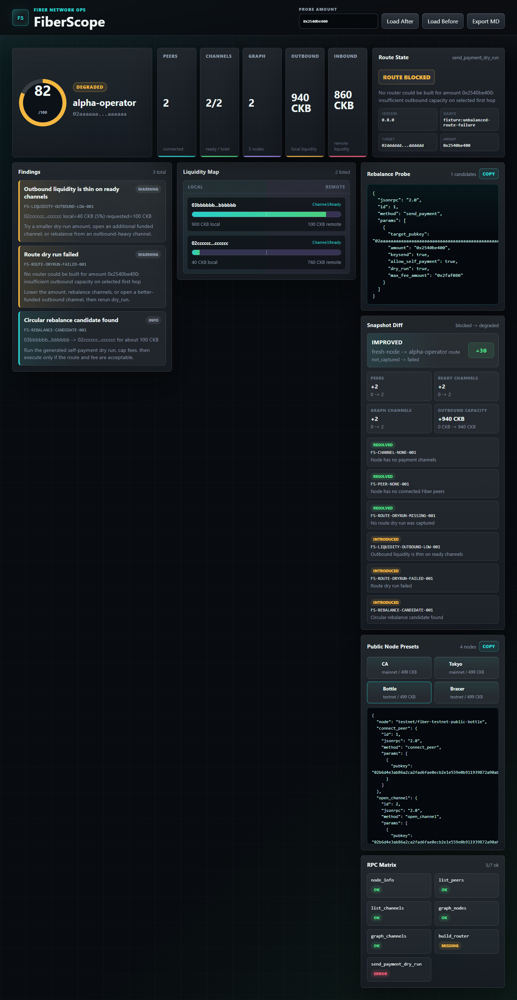
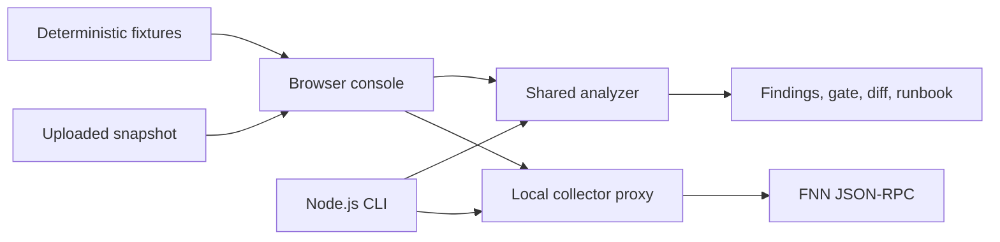

# FiberScope

FiberScope is a diagnostic console for Fiber Network nodes. It collects FNN JSON-RPC state, evaluates payment readiness, identifies operational failures, and produces a review-only remediation runbook.

[Hosted demo](https://francissix.github.io/fiber-scope/) | [Submission brief](SUBMISSION.md) | [Live validation](docs/LIVE_VALIDATION.md)



## Problem

Fiber exposes node, peer, channel, graph, and payment RPCs, but operators must correlate those responses manually when a route fails. The same symptom can come from peer loss, channels that are not ready, thin outbound liquidity, stale graph state, route construction, or missing Biscuit scopes.

FiberScope converts that evidence into one stable diagnostic contract shared by the CLI, dashboard, Markdown reports, readiness gate, and remediation runbook.

## Capabilities

| Surface | Implementation |
| --- | --- |
| Collection | `node_info`, `list_peers`, `list_channels`, bounded `graph_nodes` and `graph_channels`, optional payment dry run |
| Diagnostics | Stable finding IDs, severity, evidence, operator action, payment-readiness score |
| Automation | Strict readiness gate with exit code `2` on failure |
| Remediation | Ordered, safety-labeled, review-only RPC and CLI steps with success criteria |
| Liquidity | Outbound capacity checks and circular self-payment rebalance candidates |
| Evidence | Before/after diff, Markdown report, runbook export, RPC coverage |
| UI | Responsive route topology, findings, liquidity, gate, runbook, and snapshot upload |

## Architecture



The hosted demo is static and fixture-backed. Live RPC collection is available only through the local server, which binds to `127.0.0.1`.

## Quick Start

Requires Node.js 20 or newer. There are no runtime package dependencies.

```bash
git clone https://github.com/FrancisSix/fiber-scope.git
cd fiber-scope
npm run verify
npm run dashboard
```

Open `http://127.0.0.1:4173/`.

## Live Collection

Start FiberScope locally, open **Connect RPC**, and provide an FNN endpoint. The equivalent CLI command is:

```bash
npm run fiber-scope -- collect \
  --rpc http://127.0.0.1:8227 \
  --out snapshots/node.json \
  --graph-limit 200 \
  --graph-pages 5
```

Protected endpoint:

```bash
npm run fiber-scope -- collect \
  --rpc http://127.0.0.1:8227 \
  --auth-token <biscuit-token> \
  --out snapshots/node.json
```

Use `--amount`, `--target-pubkey`, or `--self-rebalance` to capture a `send_payment` request with `dry_run: true`. FiberScope never submits a real payment.

## CLI

```bash
npm run fiber-scope -- fixtures
npm run fiber-scope -- inspect --snapshot fixtures/unbalanced-route-failure.json
npm run fiber-scope -- gate --snapshot fixtures/healthy-ready.json
npm run fiber-scope -- runbook --snapshot fixtures/unbalanced-route-failure.json
npm run fiber-scope -- diff --before fixtures/no-peers-no-graph.json --after fixtures/unbalanced-route-failure.json
npm run fiber-scope -- presets --network testnet
```

Generated reference artifacts:

- [Diagnostic report](docs/demo-report.md)
- [Snapshot diff](docs/demo-diff.md)
- [Operator runbook](docs/demo-runbook.md)
- [CLI transcript](docs/demo-transcript.md)

## Diagnostic Contract

| Finding | Condition |
| --- | --- |
| `FS-PEER-NONE-001` | no connected Fiber peers |
| `FS-CHANNEL-NONE-001` | no payment channels |
| `FS-CHANNEL-PENDING-001` | channels have not reached `ChannelReady` |
| `FS-CHANNEL-FAILED-001` | channel failure details are present |
| `FS-LIQUIDITY-OUTBOUND-LOW-001` | ready channels cannot carry the requested first hop |
| `FS-GOSSIP-CATCHUP-001` | peer/channel state exists but public graph data is absent |
| `FS-ROUTE-DRYRUN-FAILED-001` | payment dry run or route construction failed |
| `FS-REBALANCE-CANDIDATE-001` | a circular self-payment can be dry-run across imbalanced channels |
| `FS-AUTH-SCOPE-001` | Biscuit token lacks diagnostic read scopes |
| `FS-MIGRATION-PUBKEY-001` | snapshot indicates legacy `peer_id` usage |

## Safety Boundary

- The hosted build contains no RPC proxy.
- The local server listens on loopback only.
- Biscuit tokens remain in memory and are excluded from snapshots, reports, and command previews.
- Generated write operations require approval and are never executed by FiberScope.
- Payment and rebalance probes always set `dry_run: true`.

See [SECURITY.md](SECURITY.md) for the full boundary.

## Verification

```bash
npm run verify
```

This runs 24 tests, exercises CLI workflows, regenerates demo artifacts, and builds the static site. The collector was also exercised against the Fiber documentation's public node running FNN `0.9.0-rc7`; see [live validation](docs/LIVE_VALIDATION.md).

## Project Status

Implemented: collection, analysis, gate, diff, runbook generation, fixture/static demo, local live dashboard, exports, tests, and CI deployment.

Not implemented: historical storage, autonomous remediation, real payment execution, or an internal route simulator. These are deliberate production boundaries, not mocked UI actions.

Hackathon category: **Node, Routing, Cross-Chain, and Diagnostics Infrastructure**.

License: [MIT](LICENSE).
