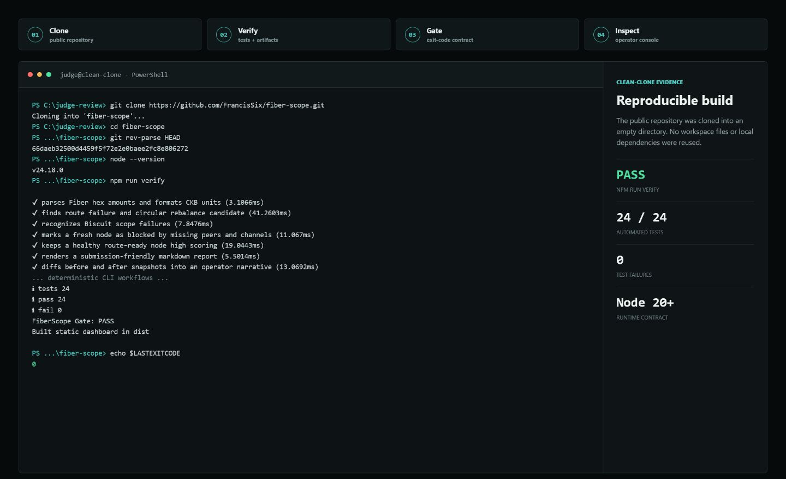
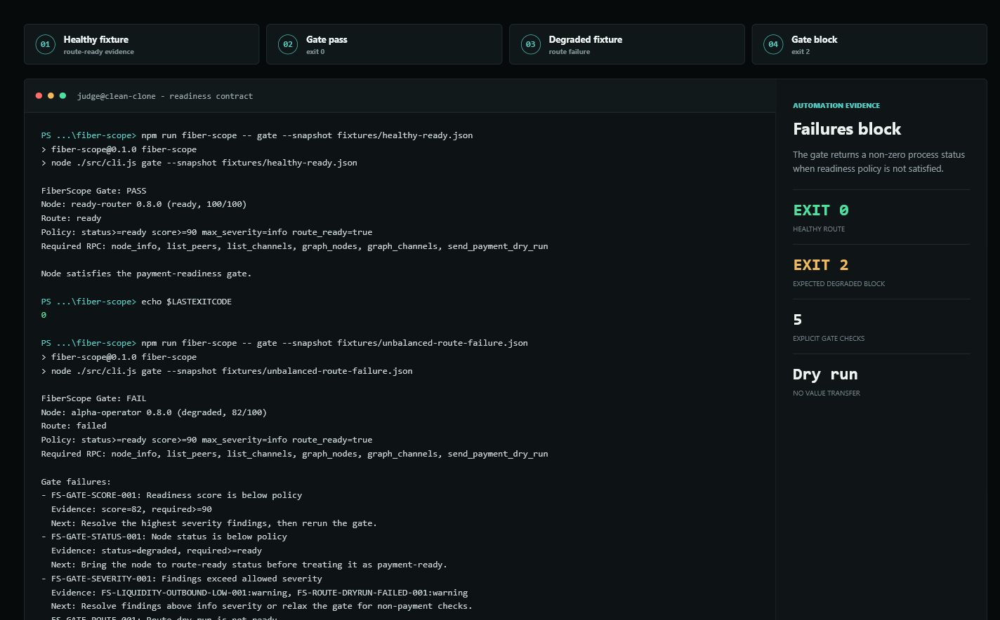
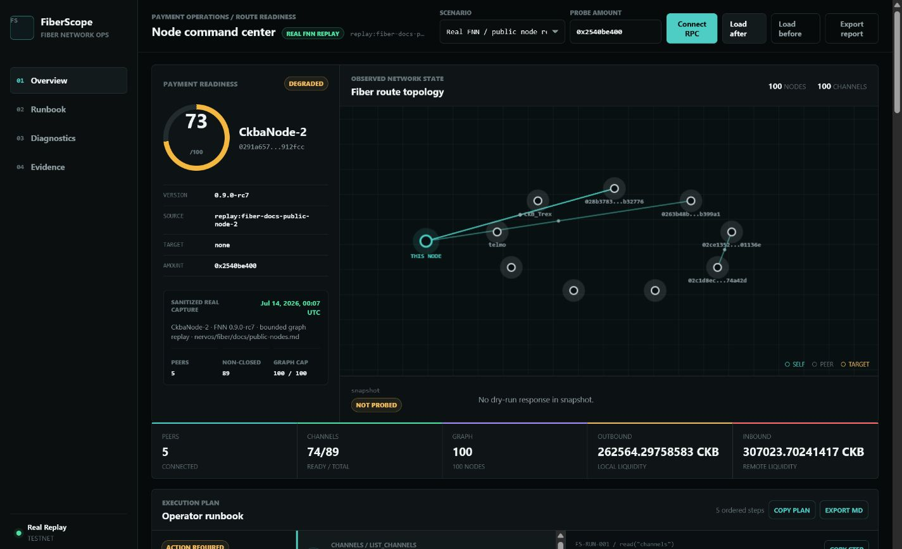
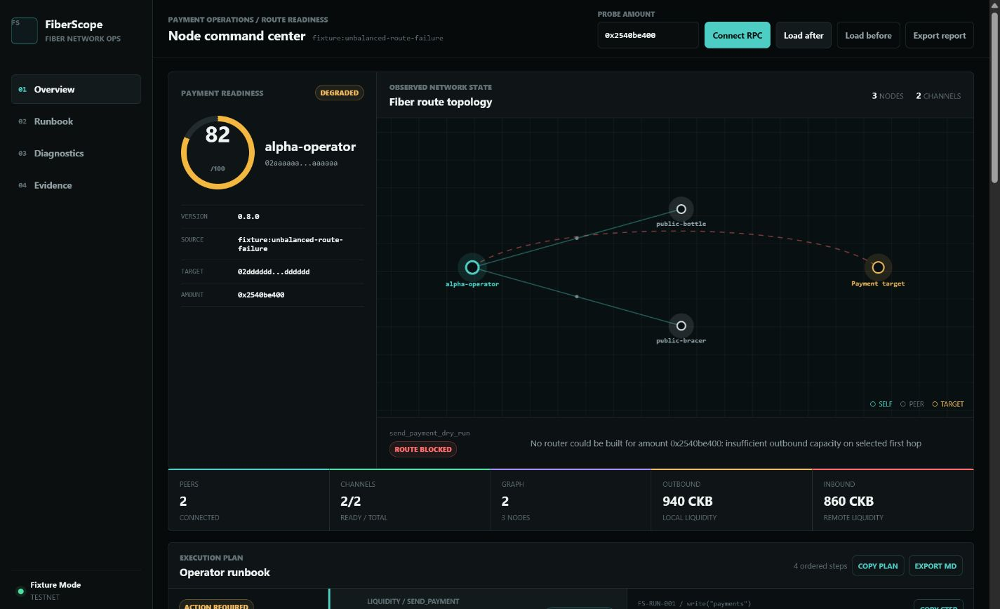
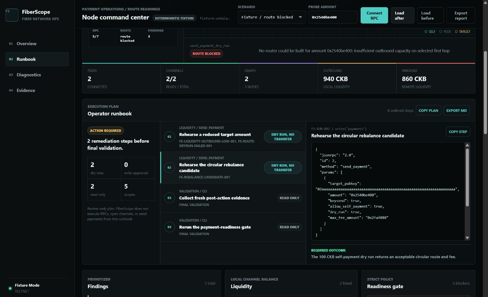
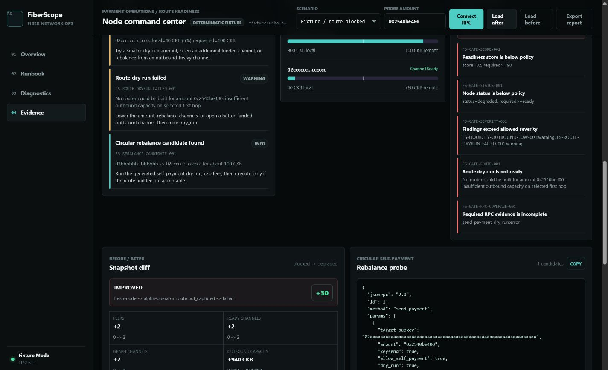

# Judge Test Flow

This flow validates FiberScope from a clean public clone. It requires Node.js 20 or newer and does not require a running FNN node for replay or deterministic scenarios.

## Acceptance Criteria

| Check | Expected result |
| --- | --- |
| Clean verification | exit `0`, 26 tests pass, 0 fail |
| Healthy readiness gate | exit `0`, status `ready`, score `100/100` |
| Degraded readiness gate | exit `2` with explicit policy blockers |
| Real replay | `CkbaNode-2`, FNN `0.9.0-rc7`, score `73`, bounded 100/100 graph evidence |
| Dashboard fixture | route-failure scenario loads with score `82`, 3 topology nodes, 2 graph channels |
| Runbook | four ordered steps; generated payment actions use `dry_run: true` |
| Evidence | before/after diff, rebalance candidate, RPC coverage, public-node presets |

## 1. Clone And Verify

```bash
git clone https://github.com/FrancisSix/fiber-scope.git
cd fiber-scope
node --version
npm run verify
```

`npm run verify` runs the test suite, exercises the CLI, regenerates reference artifacts, and builds `dist/`. The command must exit `0`.



## 2. Test The Gate Contract

Run the passing fixture:

```bash
npm run fiber-scope -- gate --snapshot fixtures/healthy-ready.json
```

Expected: `FiberScope Gate: PASS` and exit `0`.

Run the blocked fixture:

```bash
npm run fiber-scope -- gate --snapshot fixtures/unbalanced-route-failure.json
```

Expected: `FiberScope Gate: FAIL` and exit `2`. This failure is intentional; it proves that degraded readiness blocks automation.



## 3. Start The Dashboard

```bash
npm run dashboard
```

Open `http://127.0.0.1:4173/`. The server must report `FiberScope dashboard` and bind to `127.0.0.1`.

The hosted static equivalent is https://francissix.github.io/fiber-scope/. It includes the sanitized real-node replay but no collector API.

## 4. Review The Real FNN Replay

The default scenario is **Real FNN / public node replay**. Confirm:

- evidence is labeled `Real FNN replay` and `sanitized real capture`;
- node is `CkbaNode-2`, FNN `0.9.0-rc7`;
- capture timestamp and `nervos/fiber/docs/public-nodes.md` provenance are visible;
- observed counts show 5 peers, 89 non-closed channels, and a 100/100 bounded graph;
- route status is `not probed`, because the capture was strictly read-only.



## 5. Review Route Readiness

Select **Fixture / route blocked** from **Scenario**.

On **Overview**, confirm:

- source is `fixture:unbalanced-route-failure`;
- readiness is `degraded`, score `82/100`;
- the topology contains the local node, two public peers, and the payment target;
- route evidence reports insufficient outbound capacity;
- local and remote liquidity totals are visible.



## 6. Inspect The Runbook

Open **Runbook** and select **Rehearse the circular rebalance candidate**.

Confirm that the selected step:

- is labeled `dry run, no transfer`;
- uses `send_payment`;
- sets `allow_self_payment: true`;
- sets `dry_run: true`;
- includes a measurable required outcome.



## 7. Review Evidence

Open **Evidence** and confirm:

- snapshot progress is `blocked -> degraded` with a `+30` score change;
- peer, ready-channel, graph-channel, and outbound-capacity deltas are shown;
- resolved and introduced finding IDs are separated;
- the rebalance probe remains a dry run;
- RPC coverage and public-node presets are present below the fold.



## 8. Optional Live FNN Check

Live collection is local-only. Start the dashboard, select **Connect RPC**, and provide an operator-controlled FNN endpoint. The hosted demo intentionally has no collector API.

CLI equivalent:

```bash
npm run fiber-scope -- collect \
  --rpc http://127.0.0.1:8227 \
  --out snapshots/judge-node.json \
  --graph-limit 100 \
  --graph-pages 1
```

Do not provide `--amount`, `--target-pubkey`, or `--self-rebalance` for a strictly read-only collection.

## Capture Provenance

The terminal images are rendered from output captured during a clean clone of application commit `66daeb3`. The clone passed verification without workspace files or cached package dependencies. The dashboard images were captured from that clone on `127.0.0.1:4180`; the alternate port avoided the development server already running on `4173`.
